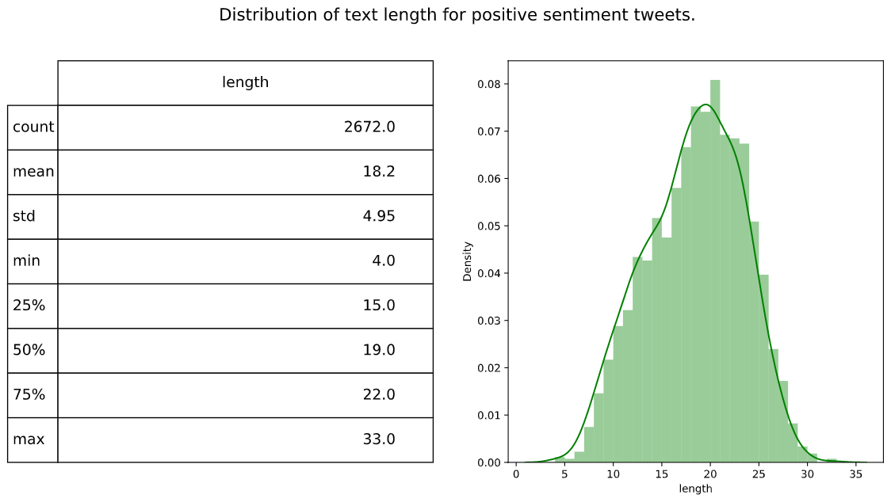
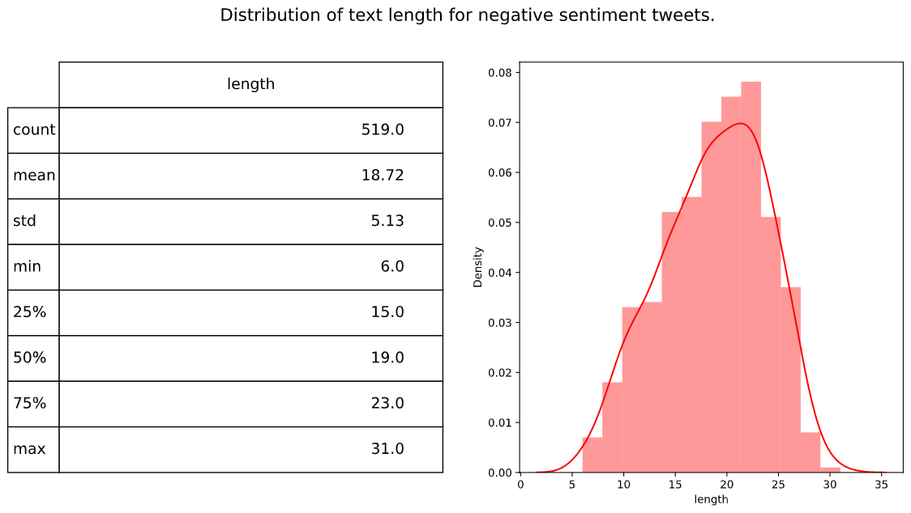
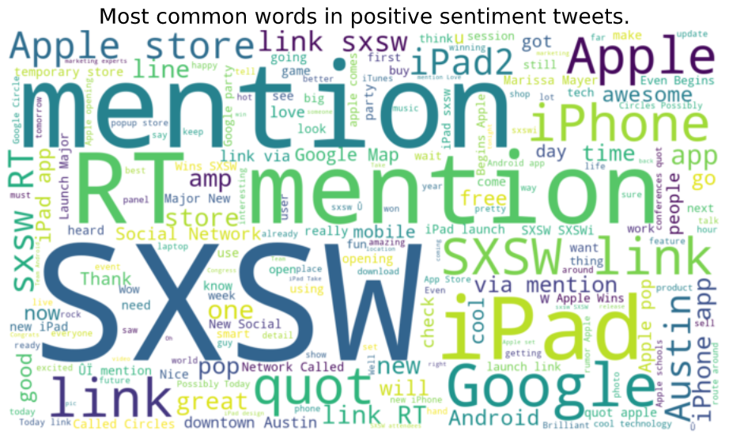
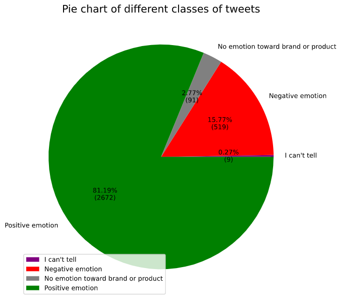
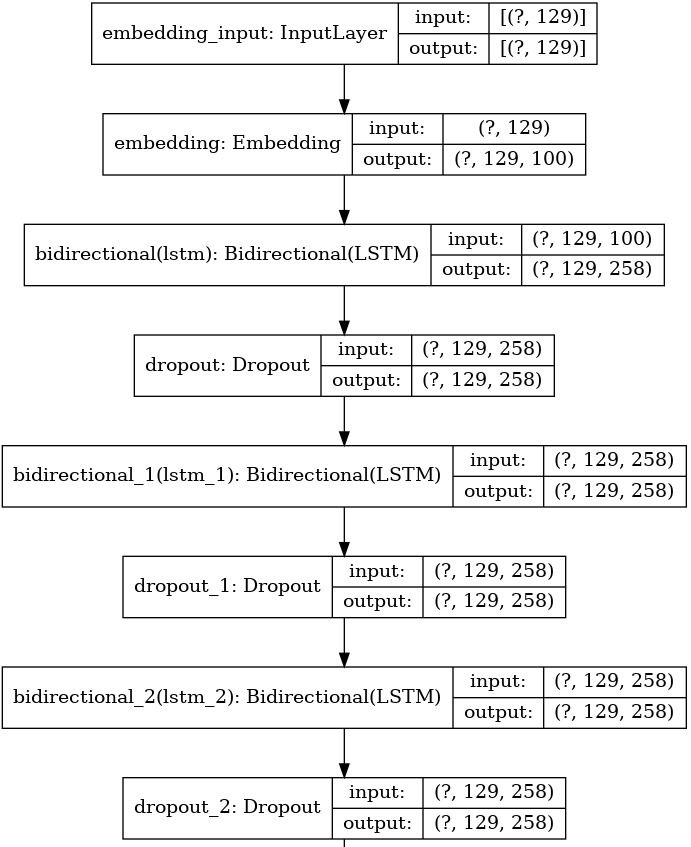
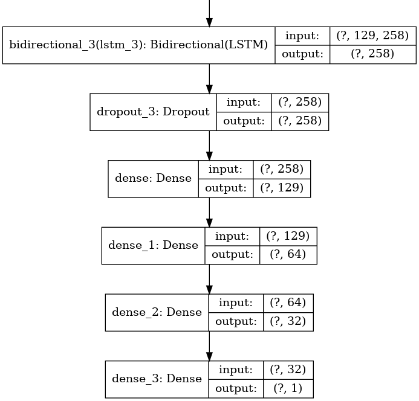
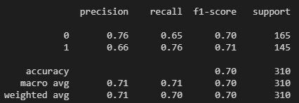
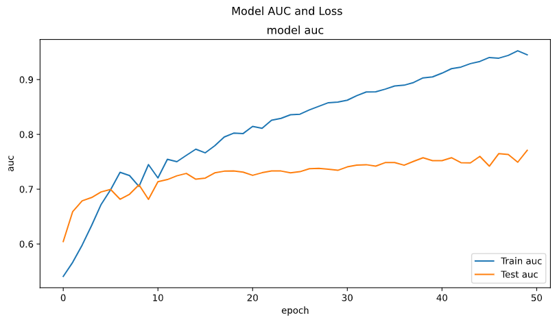
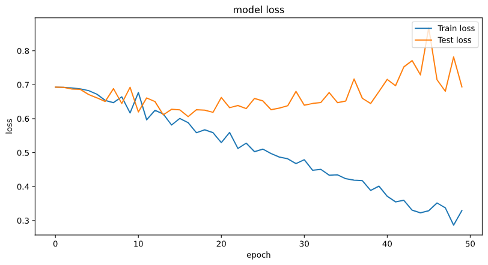
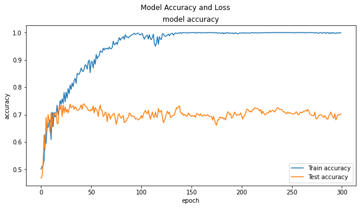

# Pump it Up: Data Mining the Water Table

**Note that the description for plots and graphs are usually above the plot and graph.**

## Summary and Recommendations

## Data
https://www.crowdflower.com/data-for-everyone/

Judge Emotion About Brands and Products
Contributors evaluated tweets about multiple brands and products. The crowd was asked if the tweet expressed positive, negative, or no emotion towards a brand and/or product. If some emotion was expressed they were also asked to say which brand or product was the target of that emotion. 

Added: August 30, 2013 by Kent Cavender-Bares 

Data Rows: 9093 

## Exploratory Data Analysis

Both positive and negative sentiment tweets have mean word count of 18 and standard deviation of 5.

Tweet word length have no correlation to sentiment.

Top words for both positive and negative tweets:
SXSW, mention, iPad, iPhone, Apple, Google

Simple keyword search won’t indicate positive or negative sentiment.

## Model

Word count and keyword search don’t identify sentiment, therefore we will try to fit a deep learning model.

There are a lot more positive emotions then the rest.

In order to fully utilize all our available data, we will make the target into only two categories: positive and non-positive.

Then undersample based on the number of non-positive data.

Many variation of the word_embedding-LSTM-dropout-dense layer models were explored, this is the one with the best performance.

## Model Performance

Average precision is 0.71.

Average recall is 0.70.

AUC score is around 0.70.

Further training doesn’t improve performance.

This model can be used to predict how customers like the product!

## Recommendations and Future Work
1. Gather more data: Sometimes more data improve model performance, but too much may increase training complexity by too much!
2. Build a continuous learning model: In case there are new terms and slogans. Language changes over time.
3. Pick an acceptable classification threshold value from the AUC ROC cruve:
Pick an acceptable risk.